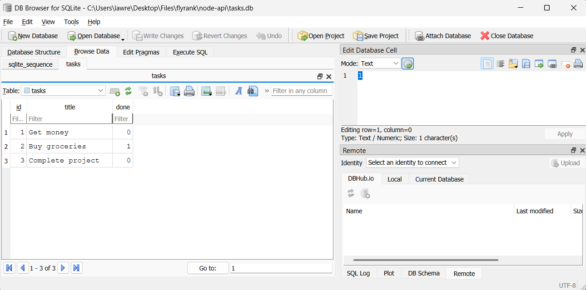
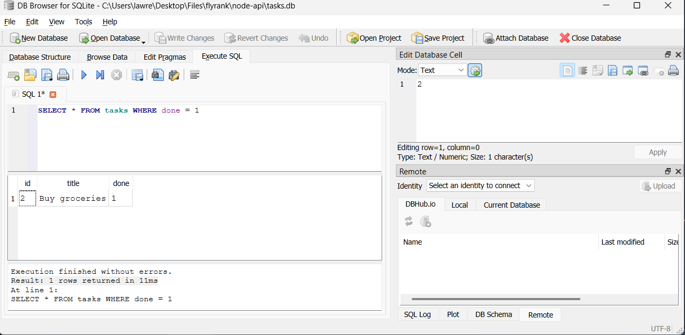

# Node API flyrank internship - Week One
A simple REST API for managing a list of tasks, built with Express. Supports listing, creating, updating, and deleting tasks, with basic input validation and proper HTTP status codes.

# Installing
```bash
npm install express && node index.js
```
The server will start on `http://localhost:3000`

## Endpoints

| Method | Endpoint      | Description                            | Success Response | Error Responses |
|--------|---------------|-----------------------------------------|-------------------|------------------|
| GET    | `/tasks`      | Get all tasks                          | 200               | -                |
| GET    | `/tasks/:id`  | Get a single task by ID                | 200               | 404 (not found)  |
| POST   | `/tasks`      | Create a new task                      | 201               | 400 (missing/invalid title) |
| PUT    | `/tasks/:id`  | Update a task's title and done status  | 200               | 400 (missing/invalid title or done), 404 (not found) |
| DELETE | `/tasks/:id`  | Delete a task by ID                    | 204               | 404 (not found)  |

## Example Request

\`\`\`bash
curl -i http://localhost:3000/tasks/1
\`\`\`

\`\`\`
HTTP/1.1 200 OK
X-Powered-By: Express
Content-Type: application/json; charset=utf-8
Content-Length: 40
ETag: W/"28-67NHGvSRikFjdMPr/9tNFpO8qg4"
Date: Tue, 14 Jul 2026 21:25:07 GMT
Connection: keep-alive
Keep-Alive: timeout=5

{"id":1,"title":"Task one","done":false}
\`\`\`

## SQL ACTIVITY 
Query I ran: SELECT * FROM tasks WHERE done = 1
Returned: id:2	title:Buy groceries	done:1

## Why SQL was chose
- SQL was chosen because of the single file structure (task.db), the near zero setup required, and the data persistency meaning that any data we input stay there even on system restart.
- The database lives in the node-api/task.db file

## DB browser screenshot


## Query screenshot


## How to use 
use npm i to install dependencies followed by npm start to initialize the project and start it up